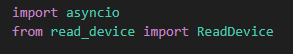

<h1 align="center">Proyecto de eficiencia energética TO_ERCO
</h1>
<h3 align="center">Sistema de visualización de datos por consola
</h3>

<!-- TABLE OF CONTENTS -->

    
Tabla de Contenidos

    <ol>
        <li><a href="#about-the-project">Acerca del proyecto</a></li>
        <li><a href="#Funcionamiento_general">Funcionamiento general</a>
            <ul>
                <li><a href="#claseReadDevice">Clase ReadDevice</a></li>
                <li><a href="#main">Script main_efficiency.py</a></li>
            </ul>
        </li>
        <li><a href="#requirement">Requerimientos</a></li>
        <li><a href="#License">Licencia</a></li>
        <li><a href="#Derechos">Derechos</a></li>
    </ol>

## Acerca del proyecto

Se implementa una aplicación para la **visualización de datos por consola** utilizando **Python**, haciendo uso de las librerías **pymodbus 3.6.9** y **pyserial 3.5**. Los datos son obtenidos desde los dispositivos **PAC3200**, **Huawei Inverter** y una **estación de monitoreo**, mediante el protocolo de comunicación **Modbus RTU (RS485)**. 

## Funcionamiento general

   
El proyecto contiene un script principal llamado **`main_efficiency.py`**, el cual:

- Importa la librería **asyncio** para la ejecución de operaciones asíncronas.
- Importa la clase **`ReadDevice`**, que proporciona la funcionalidad necesaria para leer registros desde los dispositivos mediante **Modbus**.

La aplicación permite la conexión simultanea a 3 dispositivos y obtiene los siguientes datos:
1. **PAC3200**: Dato de la energia activa del analizador de redes.
2. **Huawei Inverter**:  Dato de la energia acumulada del inversor.
3. **Estación de monitoreo**: Dato de irradiancia.

### **Clase ReadDevice**

La clase **`ReadDevice`** es el núcleo del proyecto. Sus principales componentes son:

#### 1. Constructor
El constructor define los atributos necesarios para establecer la conexión con un dispositivo Modbus y leer sus registros:
- Configuración del puerto serie.
- Parámetros como **dirección**, **cantidad de registros**, **ID del esclavo**, **paridad**, entre otros.

#### 2. Métodos Internos
- **`__start_connection()`**:  
   Método privado que establece la conexión con un dispositivo Modbus utilizando **pymodbus.client**. Devuelve un objeto cliente para la comunicación.

- **`__close_connection()`**:  
   Método privado que cierra la conexión con el dispositivo Modbus.

#### 3. Método Estático
- **`decode_registers_to_floats()`**:  
   Permite decodificar dos registros de **16 bits** que representan un **float** según la norma **IEEE 754**. Al ser un método estático, puede usarse sin necesidad de instanciar un objeto.

#### 4. Método Principal
- **`run_async_simple_client()`**:  
   Es el método principal de la clase. Se encarga de:
   - Llamar a **`__start_connection()`** para establecer la conexión.
   - Leer los registros del dispositivo.
   - Cerrar la conexión con **`__close_connection()`**.
   - Retornar los registros obtenidos del dispositivo.

### **Estructura código main_efficiency.py**

El programa principal se divide en las siguientes partes:

#### 1. `show_information_register`

Esta función es la encargada de leer los registros de Modbus desde un dispositivo, decodificarlos (si se especifica) y mostrar el valor de interés. Recibe los siguientes parámetros:

**Parámetros:**
- `serial_port`: Puerto serial del dispositivo (e.g., `COM#`).
- `function`: Código de función Modbus (e.g., `4` para lectura de registros).
- `address`: Dirección inicial de los registros.
- `quantity`: Cantidad de registros a leer.
- `slave_id`: ID del esclavo Modbus.
- `baudrate`: Velocidad de transmisión en baudios.
- `bytesize`: Tamaño del byte de datos.
- `parity`: Paridad (e.g., `E` para Event Parity).
- `stopbits`: Bits de parada (e.g., `1`).
- `label`: Etiqueta descriptiva para los registros leídos.
- `float_index`: Índice del valor flotante a imprimir después de la decodificación.

#### 2. `join_process`

La función `join_process` ejecuta múltiples tareas asíncronas en paralelo para leer registros de varios dispositivos de manera continua, con un ciclo que se repite cada segundo, sin bloquear la ejecución del programa.

1. **Ejecuta tres tareas en paralelo**:
   - Lectura de registros desde un inversor Huawei en el puerto serie `COM4`.
   - Lectura de registros desde un dispositivo Pac3200 en el puerto serie `COM2`.
   - Lectura de registros desde una estación de monitoreo en el puerto serie `COM6`.

2. **Indicador visual**:
   - Después de ejecutar las tareas, se imprimen cuatro puntos (`.`), uno cada segundo en la consola como indicador de tiempo. 

### Beneficios

- **Lecturas concurrentes**: Permite obtener datos de múltiples dispositivos sin esperar entre lecturas.
- **No bloqueante**: La función no interrumpe el hilo principal, permitiendo otras tareas simultáneas.
- **Monitoreo visual**: La impresión de puntos proporciona un feedback visual útil para monitoreo y depuración.

#### 3. `main`
Ejecuta el proceso principal de lectura en bucle hasta que se detenga manualmente.
La función main() es el punto de entrada del programa. Llama a join_process() para iniciar la ejecución continua de la lectura de los registros de los dispositivos.

Si todo funciona correctamente, se podra ver la información de interes por consola cada 5 segundos, la salida en la consola es la siguiente:

## Requerimientos
- pymodbus==3.6.9
- pyserial==3.5

## Licencias

Las librerías y el lenguaje de programación son de código abierto (open source). No se requirieron licencias adicionales para la realización de este proyecto.

    

## Derechos de autor

Todos los derechos reservados para Erco Energy.

